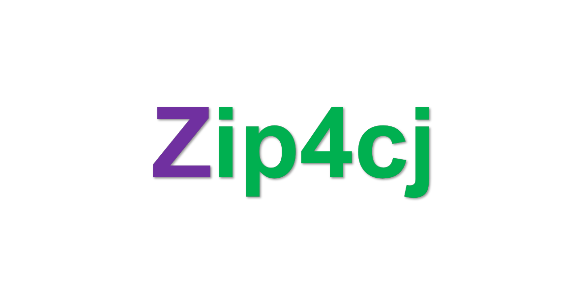

<p align="center">

</p>

<p align="center">


</p>


## 介绍

zip4cj 是基于仓颉（0.28.4）语言实现的文件压缩和解压缩，目前基本实现了zip 和 gzip 的压缩和解压缩。

### 特性

- 🚀 zip 压缩和解压缩。

- 🚀 gzip 的压缩和解压缩。

### 未来规划

- 丰富接口

- 实现压缩解密和加密

- 其他有啥想法了再添加^_^

##     架构

### 源码目录

```shell
.
├── README.md
├── doc
│   ├── assets  
│   ├── cjcov
├── src
│   ├── CentralDirectoryRecord.cj  
│   ├── CompressionMethod.cj
│   ├── EndCDR.cj  
│   ├── FileUtils
│   ├── GZUtils.cj  
│   ├── HeaderParser.cj
│   ├── LocalFileHeader.cj  
│   ├── MsDosUtils.cj
│   ├── ZipConstants.cj
│   ├── ZipFile.cj  
│   ├── ZipParams.cj
│   └── ZipSignatures.cj
└── test   
    ├── HLT
    ├── LLT
    └── UT
```

- `doc` 是库的设计文档、提案、库的使用文档、LLT 覆盖率报告
- `src` 是库源码目录
- `test` 是存放测试用例，包括 HLT 用例、LLT 用例和 UT 用例

### 接口说明

主要是核心类和成员函数说明

#### class GZUtils

##### func compress

实现 GZIP 压缩

```cangjie
/**
 * 实现 GZIP 压缩
 *
 * @param filePath 压缩文件路劲
 * @param level 压缩登等级 （0-9）
 *        LEVEL_NO_COMPRESSION      = 0
 *        LEVEL_BEST_SPEED          = 1
 *        LEVEL_DEFAULT_COMPRESSION = 6
 *        LEVEL_BEST_COMPRESSION    = 9
 * @param outFileName 压缩后的文件名
 *
 * @return 返回压缩后的文件名和数据
 * @since 0.28.4
*/
public static func compress(filePath: String, level: UInt32, outFileName: String): String * Array<UInt8>
```

##### func deCompress

实现 GZIP 解压

```cangjie
/**
 * 实现 GZIP 解压
 *
 * @param filePath 待解压的文件路劲
 *
 * @return 返回解压后的文件名和数据
 * @since 0.28.4
 */
public static func deCompress(filePath: String): String * ArrayList<UInt8>

/**
 * 实现 GZIP 解压
 *
 * @param input 待解压数据
 *
 * @return 返回解压后的文件名和数据
 * @since 0.28.4
 */
public static  func  deCompress(input: Array<UInt8>): String * ArrayList<UInt8> 
```

#### class ZipFile

##### func init

ZipFile 初始化

```cangjie
/**
 * Zip 压缩初始化
 *
 * @since 0.28.4
 */
public init()

/**
 * Zip 解压初始化
 *
 * @param filePath 待解压的文件路径
 *
 * @since 0.28.4
 */
public init(filePath: String)
```

##### func addFile

Zip 添加压缩的文件

```cangjie
/**
 * 添加压缩的文件
 *
 * @param file 添加压缩的文件路径
 *
 * @since 0.28.4
 */
public func addFile(file: String)
```

##### func addFiles

Zip 添加压缩的文件集合

```cangjie
/**
 * 添加压缩的文件集合
 *
 * @param files 问价集合，类型为 HashSet<String>
 *
 * @since 0.28.4
 */
public func addFiles(files: HashSet<String>)
```

##### func writeZip

Zip 压缩

```cangjie
public func writeZip()
```

##### func extractAll

获取压缩包中的目录

```cangjie
public func nameList(): Array<String>
```

##### func nameList

Zip 提取所有解压后的数据

```cangjie
public func extractAll()
```

##### func setOutPath

Zip 设置文件压缩后的路径

```cangjie
/**
 * 设置文件压缩后的路径
 *
 * @param outPath 压缩文件后的路径
 *
 * @since 0.28.4
 */
public func setOutPath(outPath: String)
```

#### class FileUtils

##### func writeFile

FileUtils 根据文件内容和路径写入文件

```cangjie
func writeFile(outData: Array<UInt8>, filePath: String)
```

## 编译执行

### 编译

#### 第一种方式

#### 引入charset包
 
地址：https://gitee.com/HW-PLLab/charset

#### 使用说明
 > 1、git clone https://gitee.com/HW-PLLab/charset.git<br>
 > 2、cd charset<br>
 > 3、cpm build<br>
 > 4、将build下的charset复制到仓颉环境cangjie/lib/linux_x86_64_llvm下

#### 编译时候指定library-path

    如：cjc -m . --library-path /home/lzj/cangjie/lib/linux_x86_64_llvm/charset -l charsetcharset -l charsetcharset.encoding -l charsetcharset.traditionchinese -l charsetcharset.simplechinese -l charsetcharset.korean -l charsetcharset.singlebyte -l charsetcharset.unicode

#### 第二种方式

#### 引入 testJekins 包
 
地址：https://gitee.com/HW-PLLab/testJekins 将 src 下 ci_test 放入 zip4cj 根目录下

#### 使用说明

```
git clone https://gitee.com/HW-PLLab/testJekins
apt-get install python3
python3 ci_test/main.py build
python3 ci_test/main.py test
```

### zip 示例

zip 解压

```cangjie
var zipFile= ZipFile("/mnt/c/Users/lizhenjie/Desktop/MisLinks.zip")
zipFile.setOutPath("/mnt/c/Users/lizhenjie/Desktop/MisLinks")
zipFile.extractAll()
```

zip 添加压缩

```cangjie
var zipFile= ZipFile()
    zipFile.setOutPath("/mnt/c/Users/lizhenjie/Desktop/test.zip")
    zipFile.addFile("/mnt/c/Users/lizhenjie/Desktop/test.txt")
    zipFile.addFile("/mnt/c/Users/lizhenjie/Desktop/aaa.docx")
    zipFile.writeZip()
```

gzip 添加压缩

```cangjie
var gzCompress = GZUtils.compress("/mnt/c/Users/lizhenjie/Desktop/test.txt", LEVEL_DEFAULT_COMPRESSION,
        "test.gz")
var fileName = gzCompress[0]
var compressData = gzCompress[1]
var outPath="/mnt/c/Users/lizhenjie/Desktop/"+fileName
FileUtils.writeFile(compressData, outPath)
```

gzip 解压

```cangjie
var deCompress=GZUtils.deCompress("/mnt/c/Users/lizhenjie/Desktop/test.gz")
var fName=deCompress[0]
var deCompressData=deCompress[1]
var outPath="/mnt/c/Users/lizhenjie/Desktop/"+fName
FileUtils.writeFile(Array(deCompressData), outPath)
```

## 参与贡献

主要写参与贡献的人以及个人主页链接

[@chinesebear](https://gitee.com/chinesebear)[@ahri_xiao](https://gitee.com/ahri_xiao)